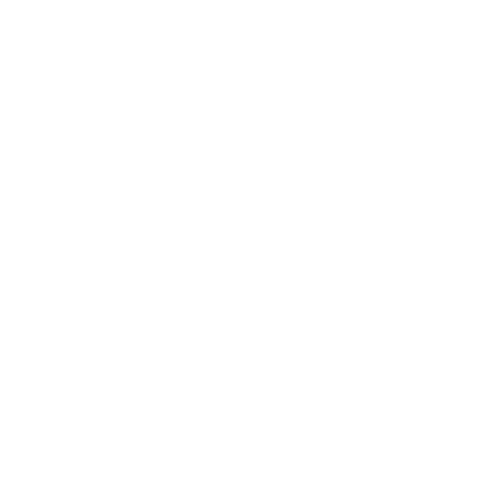

<div align="center">

<br>



<br><br>

# AKOOK Jewelries
### Brand Identity System

*by Khadija Al Dhabouni — Muscat, Oman · Est. 2020*

<br>

---

</div>

<br>

## Overview

This repository contains the complete brand identity system for **AKOOK Jewelries** — a luxury jewellery house founded in Oman in 2020. The assets here document the visual language, logo usage, color palette, and typography that define the brand across all touchpoints.

AKOOK is not simply a jewellery brand — it is a creative identity shaped by passion for design, culture, and emotional storytelling. Every design decision made here serves that mission.

<br>

---

## Contents

| File | Description |
|---|---|
| `index.html` | Interactive digital brand book — English |
| `index-fa.html` | Interactive digital brand book — Persian (فارسی) |
| `index-ar.html` | Interactive digital brand book — Arabic (عربي) |
| `logo-w.svg` | Primary brand icon (white, SVG vector) |
| `text-logo.svg` | Full wordmark lockup — AKOOK JEWELRIES (white, SVG vector) |

<br>

---

## Brand Colors

<table>
  <tr>
    <td width="80" align="center">
      
    </td>
    <td>
      <strong>Obsidian</strong><br>
      <code>#000000</code> &nbsp;·&nbsp; R 0 · G 0 · B 0 &nbsp;·&nbsp; C 0 · M 0 · Y 0 · K 100
    </td>
  </tr>
  <tr>
    <td align="center">
      
    </td>
    <td>
      <strong>Charcoal</strong><br>
      <code>#363330</code> &nbsp;·&nbsp; R 54 · G 51 · B 48 &nbsp;·&nbsp; C 67 · M 62 · Y 65 · K 59
    </td>
  </tr>
  <tr>
    <td align="center">
      
    </td>
    <td>
      <strong>Forest</strong><br>
      <code>#00371F</code> &nbsp;·&nbsp; R 0 · G 55 · B 31 &nbsp;·&nbsp; C 88 · M 47 · Y 88 · K 63
    </td>
  </tr>
</table>

<br>

---

## Typography

| Role | Typeface | Script |
|---|---|---|
| Primary / Display | **BUDA** | Latin — Logotype, Headlines |
| Arabic / RTL | **TAJM3 KUFI** | Arabic — Logotype, RTL Content |
| UI / Body (digital) | **Montserrat** | Latin — Interface, Captions |
| Editorial (digital) | **Cormorant Garamond** | Latin — Quotes, Display |

<br>

---

## Logo Usage

The AKOOK logo system consists of two elements — the **icon** (knotwork mark) and the **wordmark** — which may be used separately or as a lockup.

### Approved Backgrounds

- On Black `#000000`
- On Forest Green `#00371F`
- On Charcoal `#363330`
- On Light / Cream (inverted to black)

### Usage Rules

- Do **not** alter proportional relationships between icon and wordmark
- Do **not** rotate or tilt the logotype
- Do **not** change, lighten, or darken approved brand colors
- Do **not** place on complex or photographic backgrounds
- Do **not** apply drop shadows, gradients, or 3D effects
- Do **not** use an outline-only version

<br>

---

## Brand Book

Three fully self-contained interactive brand presentations — one per language. Open directly in any modern browser, no build tools or server required.

```bash
open index.html       # English
open index-fa.html    # Persian — فارسی
open index-ar.html    # Arabic — عربي
```

**Language versions:**

| Language | File | Direction |
|---|---|---|
| English | [`index.html`](index.html) | LTR |
| Persian | [`index-fa.html`](index-fa.html) | RTL |
| Arabic | [`index-ar.html`](index-ar.html) | RTL |

**Features:**
- Parallax hero with animated gold particles and floating logo
- Scroll-reveal animations on every section
- Custom gold cursor with magnetic ring
- Responsive across desktop, tablet, and mobile
- Film grain texture overlay for a tactile, print-like quality
- Reading progress bar
- 15 sections: Brand Identity → Founder → Vision → Mission → Core Values → Design Philosophy → Color Palette → Typography → Logo Guidelines → Brand Experience → Future Direction

<br>

---

## Design Philosophy

> *"Every design begins with a clearly defined concept. Ornamentation follows meaning — never the other way around."*

Three principles guide all creative decisions at AKOOK:

1. **Concept Before Decoration** — the idea is the architecture; beauty is its expression
2. **Emotion Embedded in Detail** — every curvature, texture, and proportion is a deliberate act of communication
3. **Balance Between Tradition and Modernity** — Omani heritage translated into forms that remain elegant and contemporary

<br>

---

## Credits

| Role | Name |
|---|---|
| Founder & Creative Director | Khadija Al Dhabouni |
| Brand & Logo Design | White Studio, Rawan Essam |
| Digital Brand Book | Milad Raeisi |

<br>

---

<div align="center">

<br>

*AKOOK Jewelries — Rebranding · Logo & Brand Identity*

*Mall of Oman, Muscat &nbsp;·&nbsp; @akookjewelries &nbsp;·&nbsp; +968 71685555*

<br>

</div>
